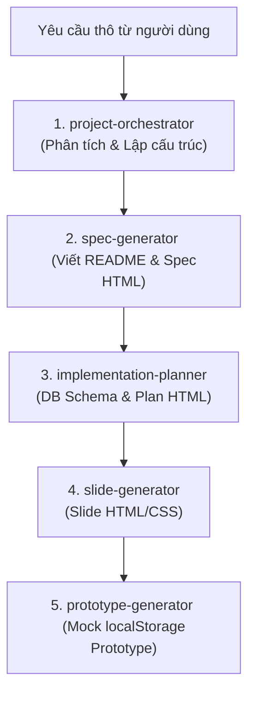

# Project Orchestrator Skill

Sử dụng kỹ năng này khi bắt đầu một dự án mới. Nó đóng vai trò là "Tổng công trình sư" phân tích thông tin đầu vào thô của người dùng, đề xuất cấu trúc MVP, và hướng dẫn người dùng phối hợp gọi tuần tự các Agent khác để hoàn thành sản phẩm.

## Luật Kích Hoạt & Cung Cấp (Trigger & Delivery Rules)

- **Trường hợp kích hoạt**: Khi người dùng bắt đầu một dự án mới bằng các từ khóa/yêu cầu dạng: `"khởi tạo dự án mới"`, `"build dự án X từ đầu"`, `"bắt đầu thiết kế app Y"`, hoặc kích hoạt trực tiếp bằng lệnh `/project-orchestrator`.
- **Định dạng đầu ra**: Một file tóm tắt dự án dạng markdown tại `.agents/output/project_overview.md` và phản hồi hướng dẫn người dùng kích hoạt skill tiếp theo (`/spec-generator`).
- **Phạm vi ngữ cảnh**: Skill này lưu trữ thông tin cơ bản về dự án (tên dự án, mục tiêu, đối tượng người dùng, các module sơ bộ) để các Agent tiếp theo có thể đọc và đồng bộ hóa.

## Quy Trình Điều Phối Workflow

- **Lưu ý**: Các thư mục `mvp/plan-high-level/`, `mvp/plan-detailed/`, và `mmp/` sẽ được tạo bởi `implementation-planner`. Đầu tiên người dùng cần chạy `/spec-generator` để tạo đặc tả, sau đó `/implementation-planner`, tiếp theo `/slide-generator`, cuối cùng `/prototype-generator`.

## Hướng Dẫn Từng Bước Cho Agent

1. **Bước 1: Tiếp nhận, Đối thoại & Phân tích thông tin (Grill & Align)**
   - Đọc yêu cầu thô của người dùng về dự án mới.
   - **Bắt buộc đối thoại (Grill):** Agent PHẢI đặt ra từ 3-5 câu hỏi trọng tâm (về các vai trò người dùng, tính năng chính, logic nghiệp vụ, in-scope vs out-of-scope) để thảo luận trực tiếp với người dùng. Chỉ khi hai bên đã thống nhất các nội dung cốt lõi mới chuyển sang bước tiếp theo.
   - Xác định mục tiêu kinh doanh, đối tượng sử dụng chính, và danh sách các module cốt lõi cần có cho bản MVP.
   
2. **Bước 2: Tạo thư mục dự án và Project Overview**
   - Khởi tạo thư mục dự án mới tại workspace với cấu trúc thư mục đầu ra chuẩn (áp dụng phong cách thiết kế **sáng màu thanh lịch**):
     - `index.html` (Đặc tả tổng thể - dashboard đặc tả sáng màu nằm tại thư mục gốc của dự án)
     - `README.md` (Tài liệu đặc tả tổng thể nằm tại thư mục gốc)
     - `mvp/` (Thư mục chứa kế hoạch MVP):
       - `mvp/plan-high-level/` (Kế hoạch MVP tổng thể: `README.md` và dashboard `index.html` sáng màu)
       - `mvp/plan-detailed/` (Kế hoạch triển khai chi tiết cho MVP: `README.md` và dashboard `index.html` sáng màu)
     - `mmp/` (Thư mục kế hoạch dài hạn / sau MVP: `README.md` và dashboard `index.html` sáng màu)
     - `prototype/` (chứa mã nguồn UAT prototype sáng màu: `index.html`, `db.js`, `style.css`...)
     - `presentation/` (chứa slide thuyết trình dự án sáng màu: `index.html`, `presentation.css`...)
   - Tạo file `.agents/output/project_overview.md` chứa thông tin tóm tắt dự án để làm bộ nhớ ngữ cảnh dùng chung (Shared Context) cho các Agent tiếp theo (mô tả rõ phong cách sáng màu thanh lịch làm chủ đạo).
   
3. **Bước 3: Hướng dẫn người dùng**
   - Trình bày tóm tắt cấu trúc dự án vừa đề xuất.
   - Hướng dẫn người dùng chạy tiếp lệnh/kích hoạt Agent `/spec-generator` để bắt đầu viết tài liệu đặc tả chức năng chi tiết và sinh Spec Dashboard sáng màu tại thư mục `spec/`.

## Tài Liệu Tham Khảo

- Hướng dẫn quản lý ngữ cảnh: [orchestration-guide.md](file:///Users/lcnghia95/workspace/3tn/docs-3tn/.agents/skills/project-orchestrator/references/orchestration-guide.md)
