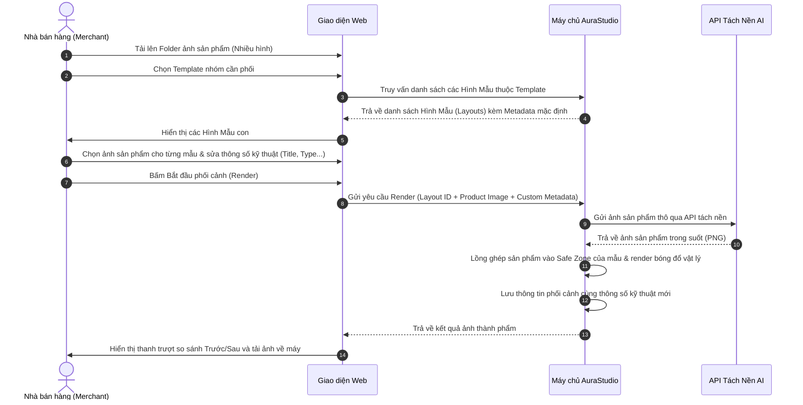

# Tài Liệu Đặc Tả Chức Năng MVP — AuraStudio

AuraStudio là giải pháp tự động hóa quy trình thiết kế hình ảnh sản phẩm thương mại điện tử và marketing bằng AI. Hệ thống hỗ trợ người dùng upload thư mục chứa nhiều ảnh sản phẩm thô, chọn Template (nhóm) và tiến hành ghép phối cảnh sản phẩm vào các **Hình Mẫu (Layouts)** chi tiết trong Template. Tại màn hình render, người dùng có quyền ghép cặp sản phẩm với hình mẫu và điều chỉnh thông tin kỹ thuật hình mẫu trước khi kết xuất ảnh.

---

## 1. Phạm Vi Sản Phẩm (In-scope vs Out-of-scope)

Dưới đây là phạm vi phát triển cho phiên bản MVP (Minimum Viable Product) so với kế hoạch dài hạn:

| Nhóm Tính Năng | Trạng Thế MVP | Ghi Chú / Quy Mô Triển Khai |
| :--- | :---: | :--- |
| **Tải lên Folder ảnh sản phẩm** | `In-scope` (✅) | Hỗ trợ tải lên nhiều tệp ảnh sản phẩm thô cùng lúc (giả lập chọn folder) với định dạng PNG, JPG, JPEG, WEBP. |
| **Thư viện Template & Hình Mẫu** | `In-scope` (✅) | Lưu trữ các Template nhóm. Mỗi Template chứa nhiều **Hình Mẫu con (Layouts)** được cấu hình sẵn phông nền, vùng an toàn (Safe Zone) và thông số kỹ thuật mẫu. |
| **Cấu hình Hình Mẫu & Safe Zone**| `In-scope` (✅) | Admin tải lên template nhóm và tạo các Hình Mẫu con, cấu hình thông số kỹ thuật (Title, Description, Type - Studio/Outdoor/Action) và vùng an toàn (x, y, w, h). |
| **Ghép cặp & Tùy chỉnh Metadata** | `In-scope` (✅) | Tại màn hình phối cảnh, Merchant chọn ảnh sản phẩm từ danh sách đã upload để ghép vào từng Hình Mẫu, đồng thời có quyền chỉnh sửa lại tiêu đề (Title), mô tả (Description), loại (Type) của hình mẫu đó trước khi render. |
| **AI Tách Nền & Đổ Bóng** | `In-scope` (✅) | Gọi REST API tách nền bên thứ ba (Remove.bg / Photoroom API). Làm mịn đường biên tiếp xúc và render bóng đổ vật lý (Drop Shadow) tại vị trí chân sản phẩm. |
| **Hàng Đợi FIFO Xử Lý** | `In-scope` (✅) | Quản lý hàng đợi xử lý bất đồng bộ, hiển thị thanh tiến trình tải lên, tách nền, co giãn và render bóng đổ. |
| **Xem trước Slider & Tải về** | `In-scope` (✅) | Giao diện thanh trượt (Slider) so sánh Trước/Sau. Cho phép tải ảnh thành phẩm chất lượng cao. |
| **Phân quyền người dùng (RBAC)**| `Out-of-scope` (❌) | MVP hợp nhất toàn bộ tính năng Admin và Merchant cho mọi người dùng, tính năng tách phân quyền sẽ được giữ cho plan dài hạn. |
| **Thiết lập Safe Zone kéo thả** | `Out-of-scope` (❌) | Tính năng vẽ vùng an toàn bằng kéo thả chuột trực tiếp trên giao diện sẽ phát triển ở phiên bản MMP sau. |
| **Đăng tải trực tiếp lên Sàn TMĐT** | `Out-of-scope` (❌) | Liên kết API đăng trực tiếp lên Shopee, Lazada, TikTok Shop sẽ thực hiện sau MVP. |

---

## 2. Vai Trò & Phân Quyền Người Dùng (RBAC Matrix)

> [!NOTE]
> **MVP Scope Adjustment**: Ở phiên bản MVP, hệ thống **không phân vai trò người dùng (no RBAC)**. Một tài khoản duy nhất được sử dụng đầy đủ toàn bộ tính năng của cả Admin (quản lý, thêm, cấu hình hình mẫu) và Merchant (tải sản phẩm, ghép cặp phối cảnh, chỉnh sửa thông số kỹ thuật bối cảnh). Cơ chế phân quyền phân vai trò sẽ được triển khai trong lộ trình phát triển dài hạn (MMP Roadmap).

Dưới đây là ma trận phân vai trò được quy hoạch cho kế hoạch MMP:

| Vai Trò | Quyền Hạn & Phạm Vi Thao Tác Chính (MMP Roadmap) |
| :--- | :--- |
| **Admin (Quản trị viên)** | - Quản lý danh mục các Template. - Thêm mới các **Hình Mẫu** vào từng Template bằng upload folder bối cảnh. - Điền thông số kỹ thuật mặc định và tọa độ Safe Zone cho hình mẫu. - Theo dõi Audit Logs của hệ thống. |
| **Merchant (Nhà bán hàng)** | - Tải lên thư mục gồm nhiều ảnh sản phẩm thô (Raw images). - Chọn Template cần phối cảnh. - Ánh xạ/ghép cặp ảnh sản phẩm vào từng Hình Mẫu có trong Template. - Thay đổi trực tiếp thông số kỹ thuật (Title, Description, Type) của hình mẫu trên giao diện phối cảnh. - Tiến hành tạo ảnh phối cảnh (Render) và tải ảnh thành phẩm so sánh Trước/Sau. |

---

## 3. Kiến Trúc Sơ Bộ & Luồng Dữ Liệu

Luồng xử lý từ lúc Merchant tải folder ảnh sản phẩm và cấu hình phối cảnh:

---

## 4. Đặc Tả Chi Tiết Module Nghiệp Vụ

### 📦 Module 1: Kho Sản Phẩm Đã Tách Nền Theo Mã SKU (Product Library by SKU)
*   **Business Rules (Luật nghiệp vụ):**
    *   Hệ thống cung cấp một **Kho Sản Phẩm** được quản lý chặt chẽ theo **Mã sản phẩm (SKU)**.
    *   Mỗi mã sản phẩm (SKU) được khởi tạo độc lập và có thể chứa **nhiều ảnh sản phẩm** (các góc chụp khác nhau).
    *   Merchant tải lên ảnh sản phẩm thô trực tiếp cho từng mã sản phẩm SKU. Mỗi ảnh tải lên sẽ tự động gọi API AI tách nền để lưu thành phẩm trong suốt liên kết trực tiếp với SKU tương ứng.
*   **User Features (Tính năng giao diện):**
    *   Form khởi tạo sản phẩm mới bằng cách nhập Mã sản phẩm (SKU) và Tên sản phẩm.
    *   Danh sách catalog hiển thị các sản phẩm dạng thẻ. Mỗi thẻ sản phẩm hiển thị mã SKU, tên sản phẩm, nút tải lên folder ảnh thô và lưới ảnh góc chụp đã tách nền ("Tách nền AI..." -> "API OK" ảnh trong suốt).

### 📦 Module 2: AI Tách Nền qua API Bên Thứ Ba
*   **Business Rules (Luật nghiệp vụ):**
    *   Gọi API tách nền bên thứ ba (Remove.bg / Photoroom API) để nhận diện chủ thể và loại bỏ phông nền thô.
    *   Tự động áp dụng bộ lọc làm mịn biên tiếp xúc (Edge Smoothing) để đảm bảo độ tự nhiên khi lồng ghép.
    *   Sản phẩm sau khi tách nền thành công mới được kích hoạt trạng thái khả dụng để sẵn sàng phối cảnh.

### 📦 Module 3: Thư Viện Template & Cấu Hình Hình Mẫu Con
*   **Business Rules (Luật nghiệp vụ):**
    *   Mỗi Template chứa từ một đến nhiều **Hình Mẫu (Layouts)**.
    *   Mỗi Hình Mẫu quy định rõ: phông nền, lớp overlay, tọa độ Safe Zone và thông số kỹ thuật mặc định gồm: Tiêu đề (Title), Mô tả (Description), Loại (Type - Studio, Outdoor, Action, Abstract, Holiday).
*   **User Features (Tính năng giao diện):**
    *   **Admin Console:** Tạo template nhóm, sau đó thêm hình mẫu con bằng cách tải ảnh lên, cấu hình Safe Zone và nhập thông tin kỹ thuật mặc định.

### 📦 Module 4: Phối Cảnh, Đổ Bóng & Chỉnh Sửa Metadata theo Mã SKU
*   **Business Rules (Luật nghiệp vụ):**
    *   Quy trình ghép cặp ảnh sản phẩm vào hình mẫu tại bối cảnh bắt buộc thực hiện theo dạng **Bộ Chọn Tuần Tự (Double Selector)**:
        *   **Bước 1:** Chọn Mã Sản Phẩm (SKU) muốn phối cảnh.
        *   **Bước 2:** Chọn Hình Ảnh Góc Chụp Đã Tách của SKU đã chọn tại Bước 1.
    *   Merchant có quyền chỉnh sửa trực tiếp các trường thông số kỹ thuật của hình mẫu. Thông tin sửa đổi này được lưu riêng vào kết quả phối cảnh (Compositions) của Merchant mà không đè lên hình mẫu mặc định của hệ thống.
*   **User Features (Tính năng giao diện):**
    *   Bảng thiết lập hình mẫu: Mỗi hình mẫu hiển thị như một thẻ gồm ảnh nền xem trước, bộ chọn SKU sản phẩm (Bước 1), bộ chọn ảnh góc chụp tương ứng của SKU đó (Bước 2 - chỉ hiển thị sau khi chọn SKU), các trường nhập liệu Title, Description, Type để chỉnh sửa trực tiếp và nút Render riêng lẻ.
