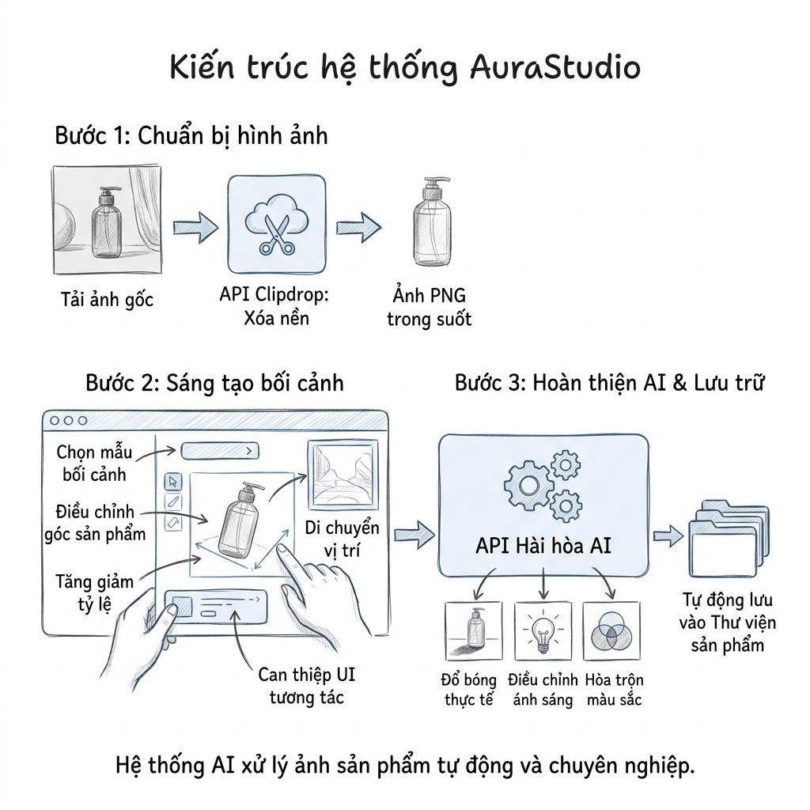
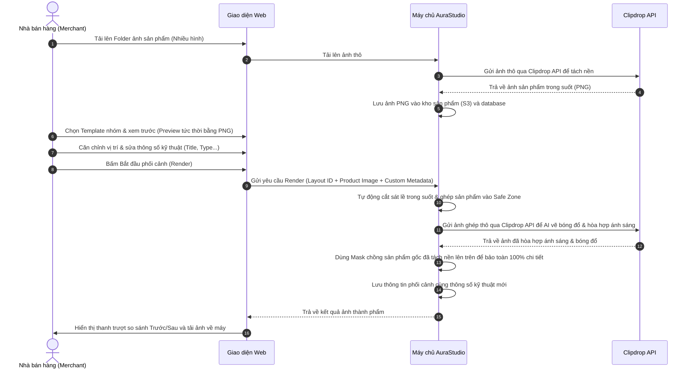

# Tài Liệu Đặc Tả Chức Năng MVP — AuraStudio

AuraStudio là giải pháp tự động hóa quy trình thiết kế hình ảnh sản phẩm thương mại điện tử và marketing bằng AI. Hệ thống hỗ trợ người dùng upload thư mục chứa nhiều ảnh sản phẩm thô, chọn Template (nhóm) và tiến hành ghép phối cảnh sản phẩm vào các **Hình Mẫu (Layouts)** chi tiết trong Template. Tại màn hình render, người dùng có quyền ghép cặp sản phẩm với hình mẫu và điều chỉnh thông tin kỹ thuật hình mẫu trước khi kết xuất ảnh.

## 🗺️ Sơ Đồ Quy Trình Hoạt Động Hệ Thống

Dưới đây là sơ đồ phác thảo quy trình xử lý 3 bước tự động của hệ thống AuraStudio giúp chủ đầu tư dễ dàng hình dung:

---

## 1. Phạm Vi Sản Phẩm (In-scope vs Out-of-scope)

Dưới đây là phạm vi phát triển cho phiên bản MVP (Minimum Viable Product) so với kế hoạch dài hạn:

| Nhóm Tính Năng | Trạng Thế MVP | Ghi Chú / Quy Mô Triển Khai |
| :--- | :---: | :--- |
| **Tải lên Folder ảnh sản phẩm** | `In-scope` (✅) | Hỗ trợ tải lên nhiều tệp ảnh sản phẩm thô cùng lúc (giả lập chọn folder) với định dạng PNG, JPG, JPEG, WEBP. |
| **Thư viện Template & Hình Mẫu** | `In-scope` (✅) | Lưu trữ các Template nhóm. Mỗi Template chứa nhiều **Hình Mẫu con (Layouts)** được cấu hình sẵn phông nền, vùng an toàn (Safe Zone) và thông số kỹ thuật mẫu. |
| **Cấu hình Hình Mẫu & Safe Zone**| `In-scope` (✅) | Admin tải lên template nhóm và tạo các Hình Mẫu con, cấu hình thông số kỹ thuật (Title, Description, Type - Studio/Outdoor/Action) và vùng an toàn (x, y, w, h). |
| **Ghép cặp & Tùy chỉnh Metadata** | `In-scope` (✅) | Tại màn hình phối cảnh, Merchant chọn ảnh sản phẩm từ danh sách đã upload để ghép vào từng Hình Mẫu, đồng thời có quyền chỉnh sửa lại tiêu đề (Title), mô tả (Description), loại (Type) của hình mẫu đó trước khi render. |
| **AI Tách Nền & Hòa Hợp Ánh Sáng** | `In-scope` (✅) | Gọi Clipdrop API tách nền khi upload và hòa hợp ánh sáng/bóng đổ (AI Harmonization) khi render phối cảnh vào Safe Zone. |
| **Bảo toàn chi tiết sản phẩm** | `In-scope` (✅) | Sử dụng cơ chế mặt nạ (Masked Composition) để đè hình sản phẩm gốc lên thành phẩm AI, giữ nguyên 100% độ sắc nét của logo/text. |
| **Hàng Đợi FIFO Xử Lý** | `In-scope` (✅) | Quản lý hàng đợi xử lý bất đồng bộ, hiển thị thanh tiến trình tải lên, tách nền AI, co giãn, chạy AI Harmonization và render thành phẩm. |
| **Xem trước Slider & Tải về** | `In-scope` (✅) | Giao diện thanh trượt (Slider) so sánh Trước/Sau. Cho phép tải ảnh thành phẩm chất lượng cao. |
| **Phân quyền người dùng (RBAC)**| `Out-of-scope` (❌) | MVP hợp nhất toàn bộ tính năng Admin và Merchant cho mọi người dùng, tính năng tách phân quyền sẽ được giữ cho plan dài hạn. |
| **Thiết lập Safe Zone kéo thả** | `Out-of-scope` (❌) | Tính năng vẽ vùng an toàn bằng kéo thả chuột trực tiếp trên giao diện sẽ phát triển ở phiên bản MMP sau. |
| **Đăng tải trực tiếp lên Sàn TMĐT** | `Out-of-scope` (❌) | Liên kết API đăng trực tiếp lên Shopee, Lazada, TikTok Shop sẽ thực hiện sau MVP. |

---

## 2. Vai Trò & Phân Quyền Người Dùng (RBAC Matrix)

> [!NOTE]
> **MVP Scope Adjustment**: Ở phiên bản MVP, hệ thống **không phân vai trò người dùng (no RBAC)**. Một tài khoản duy nhất được sử dụng đầy đủ toàn bộ tính năng của cả Admin (quản lý, thêm, cấu hình hình mẫu) và Merchant (tải sản phẩm, ghép cặp phối cảnh, chỉnh sửa thông số kỹ thuật bối cảnh). Cơ chế phân quyền phân vai trò sẽ được triển khai trong lộ trình phát triển dài hạn (MMP Roadmap).

Dưới đây là ma trận phân vai trò được quy hoạch cho kế hoạch MMP:

| Vai Trò | Quyền Hạn & Phạm Vi Thao Tác Chính (MMP Roadmap) |
| :--- | :--- |
| **Admin (Quản trị viên)** | - Quản lý danh mục các Template. - Thêm mới các **Hình Mẫu** vào từng Template bằng upload folder bối cảnh. - Điền thông số kỹ thuật mặc định và tọa độ Safe Zone cho hình mẫu. - Theo dõi Audit Logs của hệ thống. |
| **Merchant (Nhà bán hàng)** | - Tải lên thư mục gồm nhiều ảnh sản phẩm thô (Raw images). - Chọn Template cần phối cảnh. - Ánh xạ/ghép cặp ảnh sản phẩm vào từng Hình Mẫu có trong Template. - Thay đổi trực tiếp thông số kỹ thuật (Title, Description, Type) của hình mẫu trên giao diện phối cảnh. - Tiến hành tạo ảnh phối cảnh (Render) và tải ảnh thành phẩm so sánh Trước/Sau. |

---

## 3. Kiến Trúc Sơ Bộ & Luồng Dữ Liệu

Luồng xử lý từ lúc Merchant tải folder ảnh sản phẩm và cấu hình phối cảnh:

---

## 4. Đặc Tả Chi Tiết Module Nghiệp Vụ

### 📦 Module 1: Kho Sản Phẩm Đã Tách Nền Theo Mã SKU (Product Library by SKU)
*   **Business Rules (Luật nghiệp vụ):**
    *   Hệ thống cung cấp một **Kho Sản Phẩm** được quản lý chặt chẽ theo **Mã sản phẩm (SKU)**.
    *   Mỗi mã sản phẩm (SKU) được khởi tạo độc lập và có thể chứa **nhiều ảnh sản phẩm** (các góc chụp khác nhau).
    *   Merchant tải lên ảnh sản phẩm thô trực tiếp cho từng mã sản phẩm SKU. Mỗi ảnh tải lên sẽ tự động kích hoạt tiến trình gọi Clipdrop API tách nền để lưu thành phẩm trong suốt liên kết trực tiếp với SKU tương ứng.
*   **User Features (Tính năng giao diện):**
    *   Form khởi tạo sản phẩm mới bằng cách nhập Mã sản phẩm (SKU) và Tên sản phẩm.
    *   Danh sách catalog hiển thị các sản phẩm dạng thẻ. Mỗi thẻ sản phẩm hiển thị mã SKU, tên sản phẩm, nút tải lên folder ảnh thô và lưới ảnh góc chụp đã tách nền ("Tách nền AI..." -> "API OK" ảnh trong suốt).

### 📦 Module 2: AI Tách Nền & Hòa Hợp Bối Cảnh (Clipdrop API)
*   **Business Rules (Luật nghiệp vụ):**
    *   Gọi Clipdrop API để nhận diện chủ thể, loại bỏ phông nền thô và trả về ảnh PNG trong suốt lưu trữ lên S3 làm ảnh góc chụp SKU.
    *   Khi người dùng bấm phối cảnh, gọi Clipdrop API lần thứ hai để vẽ bóng đổ tự nhiên (Drop/Floor Shadow) và hòa hợp ánh sáng viền (AI Harmonization) dựa trên bối cảnh của Template.
    *   Tự động áp dụng bộ lọc và mặt nạ (Masked Composition) để bảo toàn 100% độ sắc nét chi tiết (logo, chữ trên bao bì) của sản phẩm gốc trên nền đã được AI hòa hợp.

### 📦 Module 3: Thư Viện Template & Cấu Hình Hình Mẫu Con
*   **Business Rules (Luật nghiệp vụ):**
    *   Mỗi Template chứa từ một đến nhiều **Hình Mẫu (Layouts)**.
    *   Mỗi Hình Mẫu quy định rõ: phông nền, lớp overlay, tọa độ Safe Zone và thông số kỹ thuật mặc định gồm: Tiêu đề (Title), Mô tả (Description), Loại (Type - Studio, Outdoor, Action, Abstract, Holiday).
*   **User Features (Tính năng giao diện):**
    *   **Admin Console:** Tạo template nhóm, sau đó thêm hình mẫu con bằng cách tải ảnh lên, cấu hình Safe Zone và nhập thông tin kỹ thuật mặc định.

### 📦 Module 4: Phối Cảnh, Tự Động Lưu Kho Theo SKU & Chỉnh Sửa Metadata
*   **Business Rules (Luật nghiệp vụ):**
    *   **Bộ lọc toàn cục (Global Filter Flow)**: Để đảm bảo an toàn và nhất quán dữ liệu, tại màn hình AI Studio, người dùng bắt buộc phải chọn trước Template Nhóm và Sản phẩm (SKU) ở bộ lọc phía trên. Các thẻ bối cảnh bên dưới sẽ hiển thị và tự động giới hạn lựa chọn góc chụp trong phạm vi các ảnh đã tách của SKU đã lọc.
    *   **Bộ chọn góc chụp riêng lẻ (Card-level Angle Selection)**: Góc chụp đã tách nền sẽ được chọn trực tiếp trên từng thẻ bối cảnh (template layout) để đảm bảo góc chụp của sản phẩm ăn khớp hoàn hảo với phối cảnh của từng hình mẫu.
    *   **Phối cảnh 1-click**: Hệ thống tự động đặt sản phẩm đã chọn vào Safe Zone của Hình Mẫu rồi gọi Clipdrop API để hòa hợp ánh sáng và bóng đổ.
    *   **Bảo toàn chi tiết (Masked Composition)**: Sử dụng mặt nạ đè ảnh sản phẩm gốc lên trên cùng bối cảnh AI để bảo toàn 100% độ sắc nét logo/chữ viết.
    *   **Tự động lưu vào thư viện (Auto-save to Product Library)**: Khi render thành công, ảnh thành phẩm sẽ **tự động lưu vào thư viện sản phẩm** tương ứng với SKU đã chọn, tuân theo quy tắc đặt tên thời gian hợp lý: `[SKU]_[LAYOUT_NAME]_[YYYYMMDD]_[HHMMSS].png`.
*   **User Features (Tính năng giao diện):**
    *   **Bộ lọc phía trên**: Bộ chọn Template Nhóm và Bộ chọn Sản phẩm (SKU) toàn cục.
    *   **Bảng thiết lập hình mẫu bên dưới**: Chỉ hiển thị sau khi chọn đủ Template & SKU. Mỗi thẻ bối cảnh hiển thị ảnh nền bối cảnh, tên SKU đang áp dụng, bộ chọn góc chụp (chỉ hiển thị góc chụp của SKU đã chọn), các trường sửa Title/Description/Type, nút Render và nút Tinh Chỉnh (Manual Adjust Fallback - Scale/Offset X, Y).
