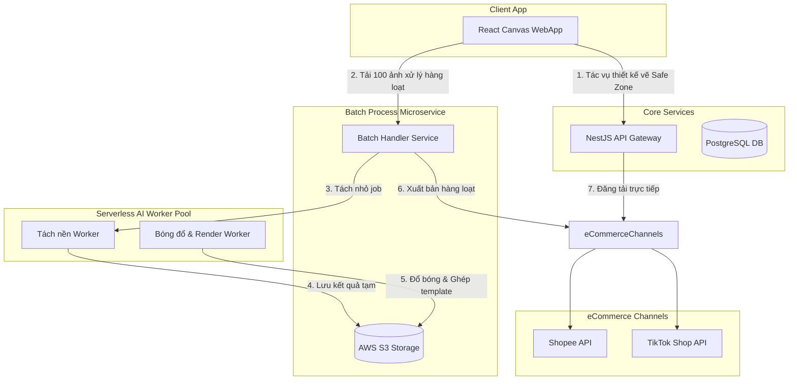

# Kế Hoạch Dài Hạn (MMP - Post-MVP) — AuraStudio

Tài liệu này trình bày lộ trình phát triển dài hạn (Minimum Marketable Product - MMP) cho dự án AuraStudio sau khi phiên bản MVP đã vận hành ổn định. Các tính năng hướng tới tối ưu hóa năng suất, tăng trải nghiệm thiết kế sáng tạo và tích hợp sâu với các nền tảng thương mại điện tử.

---

## 1. Phân Tích Logic Nghiệp Vụ MMP

| Tiêu Chí Nghiệp Vụ | Giải Thích & Lợi Ích Lâu Dài Cho Dự Án |
| :--- | :--- |
| **Công cụ Canvas vẽ Safe Zone trực quan** | Giúp Admin dễ dàng tạo template mới bằng cách vẽ trực tiếp vùng an toàn lên canvas thay vì phải tính toán và gõ tọa độ số X, Y, W, H thủ công như ở MVP. |
| **Xử lý ảnh hàng loạt (Batch processing)** | Cho phép các nhà bán hàng tải lên 50-100 ảnh thô cùng lúc, hệ thống tự động chạy ngầm tách nền và ghép chung vào 1 mẫu template giúp tiết kiệm hàng giờ làm việc thủ công. |
| **Đồng bộ trực tiếp lên sàn TMĐT** | Liên kết trực tiếp tài khoản Shopee, TikTok Shop, Lazada để đẩy ảnh thành phẩm làm ảnh đại diện sản phẩm ngay trên hệ thống AuraStudio. |
| **Chỉnh sửa sáng tạo nâng cao** | Cung cấp công cụ chèn văn bản động (tự động lấy tên sản phẩm, giá bán), chèn icon khuyến mãi (Stickers) và các bộ lọc màu đồng bộ. |

---

## 2. Sơ Đồ Kiến Trúc Mở Rộng Hệ Thống

Kiến trúc sẽ tích hợp thêm các dịch vụ mở rộng (Microservices/Serverless workers) để đảm bảo khả năng chịu tải khi xử lý hàng loạt:

---

## 3. Lộ Trình Phân Kỳ MMP (Phases - Không ghi ngày cụ thể)

*   **Phase 1 — Công Cụ Canvas Vẽ Safe Zone Trực Quan (Admin):** Phát triển thư viện Canvas kéo thả chuột để Admin tự khoanh vùng an toàn trên Template trực quan, không cần nhập tọa độ số.
*   **Phase 2 — Chỉnh Sửa Sáng Tạo & Biên Tập Ảnh Trực Tuyến:** Tích hợp bộ chèn chữ tự động (Text Overlay), chèn nhãn dán sticker khuyến mại (Khung Sale, Freeship) và bộ lọc màu nghệ thuật.
*   **Phase 3 — Xử Lý Hình Ảnh Hàng Loạt (Batch Processing):** Cho phép Merchant tải lên danh sách nhiều ảnh cùng lúc, hàng đợi tự động xử lý song song và xuất bản thư mục zip chứa toàn bộ ảnh thành phẩm.
*   **Phase 4 — Tích Hợp Đa Kênh Thương Mại Điện Tử:** Tích hợp OAuth2 và hệ thống API liên kết Shopee, Lazada, TikTok Shop để đẩy ảnh sản phẩm trực tiếp lên sàn TMĐT chỉ với 1 click.
