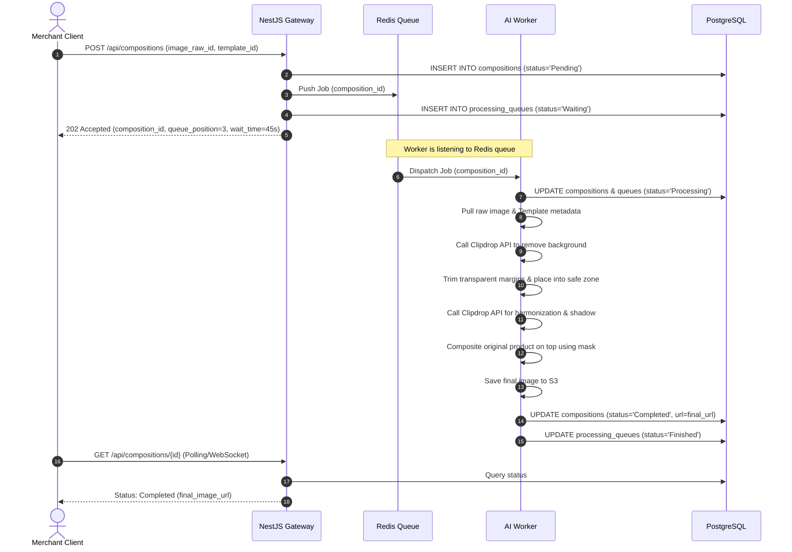

# Kế Hoạch Triển Khai Chi Tiết — AuraStudio

Tài liệu này chi tiết hóa kế hoạch triển khai, mốc thời gian (Weeks/Dates) cụ thể, sơ đồ API Sequence flow và các nhiệm vụ cụ thể cho từng thành viên trong quá trình phát triển MVP dự án AuraStudio.

---

## 1. Mốc Thời Gian Chi Tiết (Timeline 6 Tuần)

Kế hoạch triển khai dự kiến diễn ra từ ngày **06/07/2026** đến ngày **16/08/2026**:

| Tuần Triển Khai | Khoảng Thời Gian | Các Nhiệm Vụ Cốt Lõi |
| :--- | :--- | :--- |
| **Tuần 1** | 06/07/2026 – 12/07/2026 | Khởi tạo cấu trúc Clean Architecture backend (NestJS), thiết lập PostgreSQL và viết các APIs tài khoản người dùng/xác thực. |
| **Tuần 2** | 13/07/2026 – 19/07/2026 | Tích hợp Clipdrop API tách nền và lưu trữ tệp PNG tạm thời. Thiết kế hàm xử lý cắt lề trong suốt (Trim transparent margins). |
| **Tuần 3** | 20/07/2026 – 26/07/2026 | Phát triển API quản lý Template nhóm và Hình Mẫu con (Layouts), cho phép Admin cấu hình vùng Safe Zone và nhập thông số kỹ thuật mặc định. |
| **Tuần 4** | 27/07/2026 – 02/08/2026 | Phát triển API lồng ghép ảnh vào Safe Zone, gọi Clipdrop API để AI vẽ bóng đổ & hòa hợp ánh sáng, đè mặt nạ và tự động lưu ảnh phối cảnh thành phẩm vào thư viện ảnh SKU theo quy tắc đặt tên có thời gian. |
| **Tuần 5** | 03/08/2026 – 09/08/2026 | Phát triển cơ chế tải Folder hình sản phẩm hàng loạt, điều phối hàng đợi Redis FIFO Queue, hiển thị tiến trình loading và so sánh Slider Trước/Sau. |
| **Tuần 6** | 10/08/2026 – 16/08/2026 | Kiểm thử UAT tổng thể, tối ưu hóa tốc độ tách nền dưới 60s, sửa lỗi bảo mật và đóng gói sản phẩm Staging/Production. |

---

## 2. API Sequence Flow (Quy Trình Xử Lý Ảnh & Hàng Đợi)

---

## 3. Danh Sách APIs Cốt Lõi MVP

1.  `POST /api/auth/login`: Xác thực và cấp JWT Token.
2.  `POST /api/templates`: Admin tải template mới lên và nhập thông số Safe Zone.
3.  `GET /api/templates`: Truy xuất danh sách template thiết kế (hỗ trợ bộ lọc tỷ lệ).
4.  `POST /api/products`: Merchant khởi tạo sản phẩm mới (Mã sản phẩm/SKU, tên sản phẩm).
5.  `GET /api/products`: Truy xuất danh mục sản phẩm của Merchant.
6.  `POST /api/products/:productId/images`: Tải lên nhiều ảnh thô góc chụp cho mã sản phẩm, tự động kích hoạt API tách nền AI.
7.  `POST /api/compositions`: Bắt đầu quá trình phối cảnh lồng ghép sản phẩm (chọn product_image_id đã tách nền).
8.  `GET /api/compositions/:id`: Kiểm tra trạng thái xử lý ảnh và vị trí hàng đợi.
