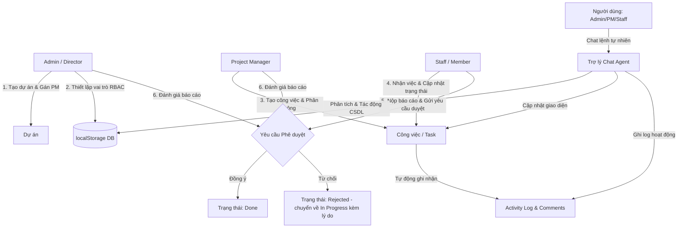

# Đặc Tả Chức Năng MVP — Task Kingston

Tài liệu này đặc tả chi tiết về phạm vi, cấu trúc phân quyền (RBAC), kiến trúc luồng nghiệp vụ và mô hình dữ liệu cho phiên bản MVP của **Task Kingston** (Hệ thống Quản lý Dự án Văn phòng).

---

## 1. Phạm Vi MVP (In-scope vs Out-of-scope)

Dưới đây là bảng so sánh chi tiết phạm vi tính năng triển khai trong phiên bản MVP so với các phiên bản sau này:

| Nhóm tính năng | MVP (In-Scope) | Sau MVP (Out-of-Scope) | Ghi chú / Quy mô thực hiện |
| :--- | :---: | :---: | :--- |
| **Quản lý dự án** | **✅** | | Tạo mới dự án, gán Project Manager, theo dõi trạng thái dự án (Active/Completed/On Hold). |
| **Quản lý công việc (Tasks)** | **✅** | | Xem dưới dạng Kanban Board và danh sách List. Hỗ trợ lọc theo trạng thái, người thực hiện, độ ưu tiên. |
| **Luồng phê duyệt (Approval)** | **✅** | | Luồng chuyển trạng thái: To Do -> In Progress -> Reviewing -> Done hoặc Rejected. Staff gửi link báo cáo, PM/Admin nhấn duyệt hoặc trả về. |
| **Trợ lý Chat Agent** | **✅** | | Panel Chat tích hợp trong Web UI giúp giao việc, tra cứu và duyệt task bằng tiếng Việt tự nhiên thông qua Regex/Keyword Parser. |
| **Lịch sử hoạt động (Logs)** | **✅** | | Ghi lại lịch sử chỉnh sửa cơ bản (ai chuyển trạng thái công việc, vào lúc nào) và lưu trữ bình luận (Comments) trong chi tiết công việc. |
| **Phân quyền RBAC** | **✅** | | Quản lý danh sách nhân viên nội bộ và gán 1 trong 3 vai trò: Admin, PM, Staff. Mỗi vai trò có quyền truy cập hạn chế tương ứng. |
| **Lưu trữ dữ liệu** | **✅** | | Lưu trữ giả lập qua `localStorage` phía client để giữ trạng thái khi tải lại trang mà không cần Server backend. |
| **Đính kèm tài liệu** | | **❌** | Không hỗ trợ tải trực tiếp file vật lý lên hệ thống. Thay vào đó, người dùng sẽ dán link tài liệu từ Google Drive/OneDrive. |
| **Hệ thống thông báo** | | **❌** | Không gửi email hoặc tin nhắn Slack thật. Chỉ thông báo giả lập trên giao diện người dùng (App Notification Bell). |
| **Biểu đồ Gantt & Phân tích** | | **❌** | Không có biểu đồ Gantt hay báo cáo phân tích năng suất nâng cao. |
| **Tích hợp Zalo/Telegram Bot** | | **❌** | Kết nối API thật qua Webhook với Zalo, Telegram, Rocket.Chat và tích hợp NLP Engine nâng cao ở backend. |

---

## 2. Vai Trò Người Dùng Trong MVP (RBAC Matrix)

Hệ thống quản lý quyền hạn chặt chẽ dựa trên 3 vai trò hệ thống:

| Quyền hạn / Thao tác | Admin | Project Manager (PM) | Staff / Member |
| :--- | :---: | :---: | :---: |
| **Tạo / Sửa / Xóa Dự án** | **✅** | ❌ | ❌ |
| **Chỉ định Project Manager** | **✅** | ❌ | ❌ |
| **Quản lý nhân viên & RBAC** | **✅** | ❌ | ❌ |
| **Tạo / Sửa / Xóa Task** | **✅** | **✅** *(Chỉ dự án phụ trách)* | ❌ |
| **Phân công task & Đặt deadline** | **✅** | **✅** *(Chỉ dự án phụ trách)* | ❌ |
| **Cập nhật tiến độ task** | **✅** | **✅** | **✅** *(Chỉ task được giao)* |
| **Gửi yêu cầu phê duyệt task** | ❌ | ❌ | **✅** *(Chỉ task được giao)* |
| **Phê duyệt / Từ chối task** | **✅** | **✅** *(Chỉ dự án phụ trách)* | ❌ |
| **Viết bình luận (Comments)** | **✅** | **✅** | **✅** |
| **Xem logs hoạt động** | **✅** | **✅** *(Chỉ dự án phụ trách)* | **✅** *(Chỉ task của mình)* |
| **Sử dụng Chat Agent giao việc** | **✅** *(Mọi dự án & vai trò)* | **✅** *(Chỉ dự án phụ trách)* | **✅** *(Chỉ cập nhật & tra cứu task mình)* |

---

## 3. Kiến Trúc Sơ Bộ & Luồng Dữ Liệu

Dưới đây là sơ đồ luồng vận hành chính giữa các vai trò trong hệ thống MVP:

---

## 4. Đặc Tả Tính Năng MVP (Detailed Modules)

### 📦 Module 1: Dashboard & Project Directory
- **Business Rules**:
  - Chỉ có Admin mới được tạo dự án mới và gán PM.
  - Các dự án có 3 trạng thái: `Active` (Đang chạy), `On Hold` (Tạm ngưng), `Completed` (Đã hoàn thành).
  - Khi một dự án chuyển sang `Completed`, tất cả các công việc chưa hoàn thành trong dự án đó sẽ tự động bị đóng băng (không cho sửa đổi trạng thái).
  - **Mẫu công việc tự động (Task Templates)**: Khi tạo dự án mới, Admin có thể chọn mẫu công việc tương ứng với loại dự án (IT/Software Development, Marketing Campaign, Office Renovation). Hệ thống sẽ tự động gieo các công việc mẫu tiêu chuẩn vào cột `To Do` của dự án với hạn chót được tính toán tự động (ngày tạo + số ngày hoàn thành).
- **System Features**:
  - Tự động tính toán tiến độ dự án dựa trên tỷ lệ % số task có trạng thái `Done` trên tổng số task của dự án đó.
  - Hiển thị thống kê nhanh: Tổng số dự án, số task trễ hạn (vượt quá due date mà chưa ở trạng thái `Done`).
  - Tự động khởi tạo và gieo các task mẫu dựa theo lựa chọn loại dự án của Admin, tính toán thời hạn deadline chính xác cho từng task mẫu.
- **User Features**:
  - Giao diện danh sách dự án (Project List Card).
  - Bộ lọc dự án theo trạng thái.
  - Nút "Tạo dự án mới" kèm cấu hình chọn loại mẫu công việc (chỉ hiển thị cho Admin).

### 📦 Module 2: Project Detail & Task Management (Kanban & List)
- **Business Rules**:
  - PM chỉ được quản lý công việc (thêm, sửa, xóa, phân công) đối với các dự án mà họ được Admin gán quyền phụ trách.
  - Mỗi công việc (Task) bắt buộc phải có: Tiêu đề, Dự án trực thuộc, Mức độ ưu tiên (`High`/`Medium`/`Low`), Hạn chót (`Due Date`) và Ngày bắt đầu dự kiến (`Plan Start Date`).
  - Một task chỉ được phân công cho tối đa 1 người thực hiện (Assignee).
  - **Logic Cảnh Báo Thời Gian Thực Thi (Execution Timing Badges)**:
    - **Bắt đầu Sớm (Early Start)**: Ngày bắt đầu thực tế (`actual_start_date`) trước ngày dự kiến (`plan_start_date`).
    - **Bắt đầu Muộn (Late Start)**: Ngày bắt đầu thực tế sau ngày dự kiến, hoặc hiện tại đã quá ngày dự kiến mà task vẫn ở trạng thái `To Do`.
    - **Hoàn thành Sớm (Early End)**: Ngày hoàn thành thực tế (`actual_end_date`) trước hạn chót (`due_date`) khi task ở trạng thái `Done`.
    - **Hoàn thành Muộn / Trễ hạn (Late End / Overdue)**: Ngày hoàn thành thực tế sau hạn chót, hoặc hiện tại đã quá hạn chót mà task vẫn chưa ở trạng thái `Done`.
- **System Features**:
  - Tự động đánh dấu nhãn cảnh báo thời gian thực thi (Bắt đầu sớm/muộn, Kết thúc sớm/muộn) bằng các nhãn màu sắc trực quan tương ứng trên thẻ công việc.
  - Tự động ghi nhận `actual_start_date` khi trạng thái task chuyển sang `In Progress` lần đầu tiên.
  - Tự động ghi nhận `actual_end_date` khi PM/Admin nhấn phê duyệt task sang `Done`.
  - Tự động sắp xếp task theo mức độ ưu tiên giảm dần hoặc theo hạn chót gần nhất.
- **User Features**:
  - Tab chuyển đổi linh hoạt giữa giao diện **Kanban Board** (cột trạng thái) và **List View** (dạng bảng chi tiết).
  - Bộ hiển thị các nhãn Badge cảnh báo thời gian thực thi ngay trên Kanban Card và List view.
  - Bộ lọc công việc nhanh theo Assignee, Mức độ ưu tiên, hoặc Trạng thái.

### 📦 Module 3: Task Detail & Activity Log / Comments
- **Business Rules**:
  - Ai cũng có quyền viết bình luận trong các task thuộc dự án họ được quyền xem. Tuy nhiên, không ai được sửa hoặc xóa bình luận của người khác (kể cả Admin, để đảm bảo tính minh bạch).
  - Mọi thao tác đổi trạng thái task hoặc thay đổi Assignee đều phải được hệ thống tự động ghi lại vào Activity Log của task đó.
- **System Features**:
  - Tự động sinh dòng Log ghi nhận dạng: `[Thời gian] - [Tên User] đã chuyển trạng thái từ [Trạng thái cũ] sang [Trạng thái mới]`.
- **User Features**:
  - Modal xem chi tiết công việc khi click vào Task Card.
  - Khung bình luận (Comment Box) hiển thị theo trình tự thời gian từ cũ đến mới.
  - Khung lịch sử hoạt động (Activity Log Tab).

### 📦 Module 4: Approval Flow (Luồng phê duyệt)
- **Business Rules**:
  - Khi Staff muốn chuyển task sang trạng thái `Done`, họ **không thể chuyển trực tiếp**. Họ phải nhấn "Gửi yêu cầu phê duyệt" (chuyển trạng thái task thành `Reviewing`), đồng thời bắt buộc phải nhập nội dung báo cáo hoặc link tài liệu đính kèm.
  - Chỉ có PM (phụ trách dự án đó) hoặc Admin hệ thống mới có quyền phê duyệt (`Approve`) hoặc từ chối (`Reject`) yêu cầu này.
  - Nếu duyệt (`Approve`), trạng thái công việc chuyển sang `Done`.
  - Nếu từ chối (`Reject`), trạng thái công việc chuyển lại về `In Progress` (hoặc `To Do`), đồng thời PM/Admin bắt buộc phải nhập lý do từ chối (feedback).
- **System Features**:
  - Ghi nhận chi tiết lịch sử duyệt (ai duyệt, duyệt lúc nào, lý do từ chối là gì nếu bị reject) vào Activity Log.
- **User Features**:
  - Modal phê duyệt dành cho PM/Admin (hiển thị nội dung Staff báo cáo, link tài liệu kèm 2 nút hành động Approve / Reject).
  - Danh sách "Công việc chờ duyệt" (Approval Queue) hiển thị ngay tại Dashboard của PM và Admin.

### 📦 Module 5: RBAC & Employee Management
- **Business Rules**:
  - Admin có quyền thay đổi vai trò hệ thống của bất kỳ người dùng nào ngoại trừ chính bản thân họ (để tránh lỗi hệ thống không có Admin nào).
  - Danh sách nhân viên và quyền hạn được hiển thị minh bạch cho tất cả thành viên xem.
- **System Features**:
  - Kiểm tra phân quyền (Role Check) tại đầu mỗi trang hoặc khi thực hiện hành động sửa đổi để chặn đứng việc truy cập bất hợp pháp.
- **User Features**:
  - Giao diện danh sách nhân sự (Employee Directory) kèm vai trò (Role Badge) và thông tin liên hệ tĩnh.
  - Màn hình cấu hình phân quyền (chỉ Admin truy cập) để thay đổi role.

### 📦 Module 6: Trợ lý Chat Agent
- **Business Rules**:
  - Người dùng chat trực tiếp với trợ lý ảo bằng ngôn ngữ tự nhiên để thao tác nhanh.
  - Chat Agent phải tuân thủ phân quyền RBAC: Nhân viên Staff không thể tạo dự án, PM không thể tạo task của dự án khác, Staff chỉ được cập nhật/tra cứu task của chính mình.
  - Các lệnh hội thoại hợp lệ:
    - **Tạo dự án**: *"Tạo dự án [Tên dự án] PM [Tên PM]"* (Chỉ Admin).
    - **Tạo & giao task**: *"Tạo task [Tên task] gán cho [Tên Staff] deadline [YYYY-MM-DD]"* (Admin/PM).
    - **Cập nhật task**: *"Cập nhật task [Mã task] sang [Trạng thái]"*.
    - **Phê duyệt**: *"Duyệt task [Mã task]"* hoặc *"Từ chối task [Mã task]"* (Admin/PM).
    - **Tra cứu**: *"Xem danh sách task của tôi"* hoặc *"Liệt kê task dự án [Tên dự án]"*.
    - **Phân tích hiệu suất**: *"Phân tích hiệu suất"* hoặc *"Phân tích dự án"* -> Bot tính toán và trả về tổng hợp số lượng task sớm/muộn/trễ hạn.
- **System Features**:
  - Sử dụng bộ phân tích Regex và từ khóa để giải cấu trúc ngôn ngữ tự nhiên thành các tham số CRUD.
  - Cập nhật đồng bộ dữ liệu trong `localStorage` và phát tín hiệu render lại UI lập tức.
  - Trả lời bằng ngôn ngữ tự nhiên tiếng Việt, mô phỏng cảm giác chat real-time (typing state).
- **User Features**:
  - Giao diện Panel Chat đầy đủ: Khung tin nhắn hội thoại cuộn tự động, bong bóng tin nhắn (User và Bot), input nhập lệnh.
  - Hiển thị các câu lệnh gợi ý ngay trên màn hình chat để người dùng dễ thao tác.

### 📦 Module 7: Model Context Protocol (MCP) Server
- **Business Rules**:
  - Hệ thống xuất bản một endpoint giao thức MCP phục vụ tích hợp với các AI Agent lập trình bên ngoài (như Cursor, Claude Desktop, Gemini Code Assist).
  - Mọi thao tác qua MCP Server đều phải được kiểm tra xác thực qua Token/Email của người dùng và tuân thủ phân quyền RBAC nghiêm ngặt.
- **System Features**:
  - Định nghĩa các MCP Tools với JSON Schema chi tiết:
    - `list_projects`: Xem danh sách dự án hiện có.
    - `create_project(name, pm_email, description)`: Tạo dự án mới (Admin).
    - `create_task(project_id, title, assignee_email, plan_start, due_date, description)`: Tạo và gán task (PM/Admin).
    - `update_task_status(task_id, status)`: Cập nhật tiến độ task (Staff/PM/Admin).
    - `submit_approval(task_id, report_text, report_link)`: Gửi duyệt hoàn thành (Staff).
    - `review_approval(task_id, action, feedback)`: Duyệt hoặc từ chối task (PM/Admin).
  - Trả về kết quả dưới dạng cấu trúc JSON chuẩn RPC 2.0. Đồng bộ hóa trực tiếp các cập nhật vào cơ sở dữ liệu hệ thống.
- **User Features**:
  - Màn hình cấu hình MCP Server cho Admin (hiển thị Token truy cập, file cấu hình mẫu `mcp-config.json` để sao chép nhanh vào IDE).

---

## 5. Luồng Nghiệp Vụ Chính & Kiểm Thử (Happy Paths)

### 🎯 Luồng 1: Admin tạo dự án & Phân công PM
1. **Bước 1**: Admin đăng nhập $\rightarrow$ Truy cập Project Dashboard $\rightarrow$ Click "Tạo dự án mới".
2. **Bước 2**: Admin điền tên dự án: `"Chiến dịch Marketing Kingston Q3"`, chọn PM phụ trách: `"Phan Văn PM"`, chọn trạng thái `"Active"`.
3. **Bước 3**: Admin nhấn "Lưu" $\rightarrow$ Dự án mới xuất hiện ở danh sách. PM nhận được thông báo giả lập trên chuông thông báo.

### 🎯 Luồng 2: PM tạo task & Giao việc cho nhân viên
1. **Bước 1**: PM đăng nhập $\rightarrow$ Vào chi tiết dự án `"Chiến dịch Marketing Kingston Q3"`.
2. **Bước 2**: PM click "Thêm công việc mới" $\rightarrow$ Nhập tiêu đề `"Thiết kế Banner quảng cáo"`, mô tả chi tiết, chọn Assignee là `"Nguyễn Văn Staff"`, mức độ ưu tiên `"High"`, deadline `"30/06/2026"`.
3. **Bước 3**: PM bấm "Tạo" $\rightarrow$ Task được thêm vào cột `To Do` của dự án. Staff được phân công sẽ nhận được thông báo giao việc.

### 🎯 Luồng 3: Staff thực hiện công việc & Gửi yêu cầu duyệt
1. **Bước 1**: Staff đăng nhập $\rightarrow$ Vào Dashboard cá nhân, thấy task `"Thiết kế Banner quảng cáo"` ở cột `To Do`.
2. **Bước 2**: Staff kéo thả hoặc bấm nút chuyển trạng thái sang `In Progress` để tiến hành làm việc.
3. **Bước 3**: Sau khi làm xong, Staff bấm "Gửi duyệt" $\rightarrow$ Một popup hiện lên yêu cầu dán link báo cáo. Staff nhập: `"Đã hoàn thành thiết kế, link Figma: figma.com/kingston-banner"`.
4. **Bước 4**: Staff bấm gửi $\rightarrow$ Task tự động chuyển sang cột `Reviewing`. Staff không thể kéo thả hay sửa đổi gì thêm. PM nhận được thông báo có task chờ duyệt.

### 🎯 Luồng 4: PM Phê duyệt hoặc Từ chối yêu cầu
1. **Bước 1**: PM đăng nhập $\rightarrow$ Truy cập danh sách "Chờ duyệt" (Approval Queue) $\rightarrow$ Thấy task `"Thiết kế Banner quảng cáo"`.
2. **Bước 2**: PM click vào để xem link Figma và báo cáo của Staff.
3. **Bước 3** (Nhánh Approve): PM thấy chất lượng tốt $\rightarrow$ Click **Approve** $\rightarrow$ Task chuyển sang trạng thái `Done`. Dòng log tự động ghi nhận task hoàn thành.
4. **Bước 4** (Nhánh Reject): PM thấy thiếu kích thước banner $\rightarrow$ Click **Reject** $\rightarrow$ Nhập phản hồi: `"Cần bổ sung thêm phiên bản kích thước Mobile"` $\rightarrow$ Task tự động quay về cột `In Progress`. Staff nhận được phản hồi và thông báo.

### 🎯 Luồng 5: Tương tác qua Trợ lý Chat Agent (Giao việc bằng chat)
1. **Bước 1**: Admin hoặc PM truy cập tab **Trợ lý Task Agent**.
2. **Bước 2**: Nhập câu lệnh: `"Tạo task Viết tài liệu API gán cho Nguyễn Văn Staff deadline 2026-07-08"` $\rightarrow$ Bấm Gửi.
3. **Bước 3**: Chat Agent phân tích cú pháp, xác thực vai trò PM và dự án được giao $\rightarrow$ Thực hiện tạo task trong database $\rightarrow$ Gửi thông báo cho Staff $\rightarrow$ Phản hồi trong chat: `"Đã tạo thành công task 'Viết tài liệu API' gán cho Nguyễn Văn Staff, hạn chót 08/07/2026."`
4. **Bước 4**: Task mới lập tức hiển thị ở cột `To Do` trên Kanban Board khi người dùng chuyển sang tab Kanban.

### 🎯 Luồng 6: AI Agent gọi MCP Server để giao việc tự động
1. **Bước 1**: AI Agent của nhà phát triển phát hiện một lỗi Bug trong build log hoặc trong mã nguồn vừa phân tích ➔ Tự động kết nối tới Task Kingston MCP Server.
2. **Bước 2**: AI Agent gọi tool `create_task` với tham số: `{ project_id: "PROJ_1", title: "Sửa lỗi crash Router", assignee_email: "staff1@kingston.vn", due_date: "2026-07-04" }`.
3. **Bước 3**: MCP Server xác thực quyền hạn và ghi nhận task mới vào CSDL ➔ Trả về phản hồi JSON thành công cho AI Agent.
4. **Bước 4**: Thẻ task `"Sửa lỗi crash Router"` tự động xuất hiện trên Kanban Board của dự án, nhân viên Staff được phân công lập tức thấy công việc trên Portal của mình.
