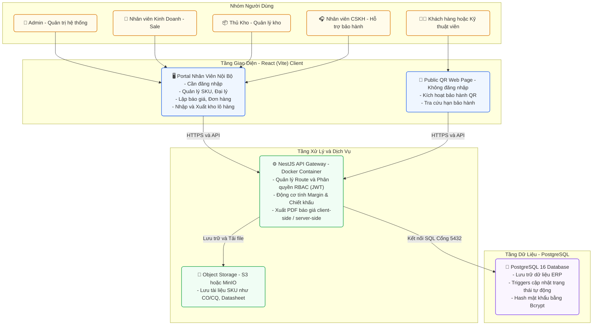

# Đặc Tả MVP — Solando ERP (Hệ Thống Nội Bộ)

> **Mục tiêu MVP:** Ra nhanh một hệ thống nội bộ để nhân viên Solando vận hành được ngay — quản lý sản phẩm, báo giá, kho, đại lý và kích hoạt bảo hành. Không build portal đại lý trong MVP đầu tiên.

---

## 1. Phạm Vi MVP (In-scope vs Out-of-scope)

| Nhóm tính năng | MVP? | Ghi chú |
|---|:---:|---|
| 🔑 Đăng nhập & Phân quyền (RBAC) | ✅ | Bắt buộc — Admin, Sale, Thủ kho, CSKH |
| 📦 Quản lý Sản phẩm (SKU, tài liệu) | ✅ | Bắt buộc |
| 🏢 Quản lý Đại lý & Khách hàng | ✅ | Bắt buộc |
| 📋 Báo giá & Pricing Engine | ✅ | Bắt buộc — xuất PDF |
| 📝 Đơn hàng (tạo từ báo giá, theo dõi trạng thái) | ✅ | Bắt buộc |
| 📦 Nhập kho / Quản lý Lô hàng & Serial | ✅ | Bắt buộc |
| 🛠️ Kích hoạt Bảo hành (QR public + nội bộ) | ✅ | Bắt buộc |
| 📊 Báo cáo Doanh số, Tồn kho, Lịch sử Serial | ✅ | Bắt buộc |
| 🔔 In-App Notification (thông báo nội bộ) | ✅ | Bắt buộc |
| 🌐 Portal Đại lý (tự đăng nhập, đặt hàng) | ❌ | Sau MVP |
| 💬 Zalo/Email notification | ❌ | Sau MVP |
| 🎫 Quản lý Ticket sự cố | ❌ | Sau MVP |

---

## 2. Vai Trò Người Dùng Trong MVP

| Role | Quyền chính |
|---|---|
| **Admin** | Toàn quyền — cấu hình hệ thống, duyệt báo giá, quản lý tài khoản |
| **Kinh Doanh (Sale)** | Quản lý đại lý, lập báo giá, tạo đơn hàng |
| **Thủ Kho** | Nhập kho, quản lý lô hàng & serial, kích hoạt bảo hành nội bộ |
| **CSKH** | Tra cứu lịch sử serial, kích hoạt bảo hành nội bộ, xem thông tin đại lý/End-User |

---

## 3. Kiến Trúc Hệ Thống (Architecture)

Hệ thống Solando ERP (phiên bản React (Vite) + NestJS + PostgreSQL) bao gồm các thành phần lớn sau:



---

## 4. Đặc Tả Tính Năng MVP (Chi Tiết)

---

### Module 1: Xác Thực & Phân Quyền

**System Features:**
- Đăng nhập bằng Email + Password, mã hóa Bcrypt.
- Cấp JWT Token kèm thông tin Role.
- RBAC: Chặn truy cập API theo Role ở tầng middleware.
- Ghi nhận Audit Log (ai, làm gì, lúc nào).

**User Features:**
- Trang đăng nhập chung cho nhân viên nội bộ.
- Admin: Tạo, sửa, khóa tài khoản nhân viên + gán Role.
- Trang đổi mật khẩu cá nhân.

---

### Module 2: Quản Lý Sản Phẩm (SKU)

**Business Rules:**
- Mỗi SKU có: Tên, Mã SKU, Hãng, Nhóm sản phẩm (Inverter / Pin / Tấm pin / Phụ kiện), Thời hạn bảo hành (tháng), Giá bán đề xuất (MSRP).
- SKU gắn liền với file tài liệu: Datasheet, CO/CQ, Catalog.
- Các thiết bị chính (Inverter, Pin Lithium) yêu cầu quản lý Serial Number khi nhập kho. Phụ kiện quản lý theo số lượng.
- Thời hạn bảo hành mặc định cấu hình trên từng SKU (ví dụ: Inverter 60 tháng, Pin Lithium 120 tháng).

**System Features:**
- Phân loại sản phẩm tự động theo nhóm.
- Lưu trữ và quản lý phiên bản file tài liệu kỹ thuật đính kèm.

**User Features (Admin / Sale):**
- Danh sách sản phẩm: Tìm kiếm, lọc theo nhóm, hãng.
- Form tạo/sửa SKU: Điền thông số kỹ thuật, thời hạn bảo hành, upload tài liệu CO/CQ, Datasheet.
- Cấu hình bảng giá theo Tier (Tier 1 / Tier 2 / Bán lẻ) cho từng SKU.

---

### Module 3: Quản Lý Đại Lý & Khách Hàng

**Business Rules:**
- Đại lý được phân hạng: Tier 1, Tier 2, Khách lẻ.
- Mỗi đại lý được gán cho một nhân viên Kinh doanh (Sale) phụ trách chăm sóc.
- End-User lưu kèm Đại lý phụ trách (liên kết qua kích hoạt QR).

**System Features:**
- Phân loại và tự động phân bổ thông tin đại lý theo khu vực hoặc sale phụ trách.

**User Features (Sale / Admin):**
- Danh sách Đại lý: Tìm kiếm, xem tóm tắt (Tier, Sale phụ trách, thông tin liên hệ).
- Form tạo/sửa Đại lý: Tên, MST, Địa chỉ, Số điện thoại, Email, Tier.
- Trang chi tiết Đại lý: Lịch sử đơn hàng, thông tin liên hệ chi tiết.
- Danh sách End-User: Tra cứu theo tên, SĐT hoặc Đại lý phụ trách.

---

### Module 4: Báo Giá & Pricing Engine

**Business Rules:**
- Khi Sale chọn Đại lý, hệ thống tự động áp bảng giá theo Tier của Đại lý đó.
- Sale có thể nhập thêm chiết khấu % trên từng dòng sản phẩm.
- Margin % được tính dựa trên giá vốn lô hàng gần nhất đang có trong kho.
- Khi Margin dưới ngưỡng → Báo giá bị khóa ở trạng thái "Chờ duyệt" → Admin nhận In-App notification để phê duyệt hoặc từ chối.
- *Ngưỡng Margin cụ thể sẽ được cấu hình trong System Config sau khi nghiệp vụ thực tế được xác nhận.*
- Luồng chuyển đổi: Báo giá → (Sale xác nhận đại lý đồng ý miệng) → Tạo Đơn hàng.

**System Features:**
- Pricing Engine: Tự động điền giá Tier khi Sale chọn sản phẩm.
- Margin Evaluator: Tính Margin % realtime theo từng dòng và tổng báo giá.
- PDF Generator: Xuất file báo giá PDF chuyên nghiệp (tên đại lý, SKU, số lượng, đơn giá, chiết khấu, tổng tiền, thời hạn hiệu lực).

**User Features (Sale):**
- Giao diện lập báo giá: Chọn Đại lý → Thêm sản phẩm → Xem Margin realtime → Điều chỉnh chiết khấu.
- Nút "Xuất PDF" để gửi cho Đại lý qua Zalo/Email.
- Nút "Chuyển thành Đơn hàng" sau khi đại lý đồng ý.
- Danh sách báo giá: Theo dõi trạng thái (Draft / Chờ duyệt / Đã duyệt / Đã chuyển đơn).

**User Features (Admin):**
- Danh sách báo giá "Chờ duyệt": Xem chi tiết Margin, giá vốn, chiết khấu.
- Nút Phê duyệt / Từ chối kèm lý do.

---

### Module 5: Đơn Hàng

**Business Rules:**
- Đơn hàng chỉ được tạo từ Báo giá đã được duyệt (hoặc tự duyệt nếu Margin đạt ngưỡng).
- Trạng thái vòng đời đơn hàng:
  ```
  Draft → Đã xác nhận → Đang chuẩn bị hàng → Đã xuất kho → Hoàn thành / Đã hủy
  ```
- Mỗi chuyển trạng thái được ghi nhận: Ai thực hiện, lúc mấy giờ.

**System Features:**
- Sao chép toàn bộ thông tin từ Báo giá sang Đơn hàng khi chuyển đổi.

**User Features (Sale / Admin):**
- Danh sách đơn hàng: Lọc theo trạng thái, Đại lý, khoảng thời gian, Sale phụ trách.
- Màn hình chi tiết đơn hàng: Danh sách sản phẩm, giá trị, lịch sử trạng thái.

---

### Module 6: Nhập Kho & Quản Lý Serial

**Business Rules:**
- Mỗi đợt nhập hàng tạo một Lô (Batch): Mã lô, ngày nhập, nhà cung cấp, giá vốn nhập khẩu của lô đó.
- Thiết bị có Serial (Inverter, Pin): Bắt buộc đăng ký số Serial khi nhập kho.
- Phụ kiện không có Serial: Quản lý theo số lượng đơn thuần.
- Trạng thái Serial: `In Stock` → `Shipped` → `Activated`.
- **Giá vốn Đích danh:** Khi xuất kho, giá vốn thực tế của thiết bị = Giá nhập của Lô hàng chứa Serial đó.
- Quy trình xuất & nhập kho: Sử dụng số Serial sẵn có của nhà sản xuất. Nhập kho bằng cách import file Excel danh sách Serial hoặc quét mã vạch. Xuất kho bằng cách quét mã Serial trên máy (dùng súng quét hoặc camera PWA) hoặc nhập tay nếu tem mờ.

**System Features:**
- Serial Validator khi xuất kho: Kiểm tra Serial tồn tại, đúng SKU, không trùng phiếu xuất khác.
- Serial-COGS Mapper: Tự động tra Lô hàng gốc của Serial để lấy giá vốn chính xác.
- Traceability Logger: Ghi log toàn bộ vòng đời Serial.

**User Features (Thủ kho):**
- Màn hình Nhập Kho: Tạo phiếu nhập → Gắn Lô → Nhập giá vốn lô → Import file Excel danh sách Serial hoặc nhập thủ công.
- Trang Tồn Kho: Xem số lượng tồn theo từng SKU, phân tách theo Lô.
- Màn hình Xuất Kho: Gắn phiếu xuất vào Đơn hàng → Chọn dòng chi tiết đơn hàng (Order Line) → Nhập/Quét Serial xuất đi.

---

### Module 7: Kích Hoạt Bảo Hành

**Business Rules:**
- Ngày hết hạn bảo hành = Ngày kích hoạt + Thời hạn bảo hành chuẩn của SKU.
- Khi kích hoạt: Liên kết Serial ↔ Dòng chi tiết đơn hàng (Order Line) ↔ Đại lý phụ trách ↔ End-User.
- Kỹ thuật viên Solando quét QR thực địa để xác thực: Serial này có thuộc hệ thống Solando không? Đại lý nào lắp?
- Nếu Đại lý gốc đã `Inactive` → Hệ thống cảnh báo để CSKH Solando xử lý trực tiếp.

**System Features:**
- QR Mapping Engine: Khi kích hoạt, tự động tra Serial → Dòng chi tiết đơn hàng (Order Line) → Đơn hàng gốc → Đại lý.
- Tính toán và lưu ngày hết hạn bảo hành.
- Xác thực Serial: Serial có tồn tại trong hệ thống Solando không?

**User Features:**
- **Public QR Web Form (Không cần đăng nhập):**
  - Quét/nhập Serial → Điền thông tin End-User (Tên, SĐT, Địa chỉ lắp) → Chọn Đại lý thi công → Xác nhận kích hoạt.
- **Kích hoạt nội bộ (Thủ kho / CSKH):**
  - Tìm kiếm Serial → Điền thông tin End-User → Gán Đại lý → Kích hoạt thủ công trong hệ thống.
- **Tra cứu Bảo hành (Public, không cần đăng nhập):**
  - Nhập Serial → Xem trạng thái, ngày hết hạn bảo hành.

---

### Module 8: Báo Cáo

**Báo cáo trong MVP:**

| Báo cáo | Bộ lọc | Người dùng |
|---|---|---|
| **Doanh số** (Tổng giá trị đơn hàng hoàn thành) | Theo tháng / Theo Đại lý / Theo Sale | Admin, Sale |
| **Tồn Kho Hiện Tại** (Số lượng tồn theo SKU, phân tách theo Lô, giá vốn từng lô) | Theo SKU / Theo Lô | Admin, Thủ kho |
| **Lịch Sử Serial** (Tra cứu toàn bộ vòng đời một Serial) | Nhập số Serial | Admin, Sale, CSKH |

---

### Module 9: Thông Báo Nội Bộ (In-App Notification)

**Các sự kiện kích hoạt thông báo:**

| Sự kiện | Người nhận |
|---|---|
| Báo giá có Margin thấp → Chờ duyệt | Admin |
| Đơn hàng được duyệt | Sale phụ trách |
| Báo giá bị từ chối | Sale tạo báo giá |

**Cách hiển thị:** Icon notification bell ở góc trên màn hình, click để xem danh sách thông báo và click vào từng thông báo để navigate đến đối tượng liên quan.

---

## 5. Luồng Chính Cần Kiểm Thử (Happy Path)

### Luồng 1: Sale lập báo giá và tạo đơn hàng
```
Sale chọn Đại lý
→ Hệ thống tự áp giá Tier
→ Sale thêm SKU, điều chỉnh chiết khấu
→ Hệ thống hiển thị Margin realtime
→ [Nếu Margin thấp] Admin nhận notification → Phê duyệt
→ Sale xuất PDF gửi Đại lý
→ Đại lý đồng ý (miệng)
→ Sale nhấn "Chuyển thành đơn hàng"
→ Đơn hàng chuyển "Đang chuẩn bị hàng"
```

### Luồng 2: Nhập kho và gắn Serial
```
Thủ kho tạo phiếu nhập kho
→ Tạo mã Lô mới (ngày nhập, giá vốn)
→ Import file Excel Serial từ nhà sản xuất
→ Hệ thống lưu từng Serial vào Lô, trạng thái "In Stock"
```

### Luồng 3: Kích hoạt bảo hành qua QR
```
Kỹ thuật viên quét QR trên Inverter
→ Trang web form mở ra (không cần login)
→ Serial tự động điền
→ Điền thông tin End-User + chọn Đại lý thi công
→ Xác nhận kích hoạt
→ Hệ thống liên kết: Serial ↔ Đại lý ↔ End-User, tính ngày hết hạn BH
```

---

## 6. Những Điều Chưa Xác Định — Cần Làm Rõ Với Khách Hàng

| Hạng mục | Trạng thái | Ghi chú |
|---|:---:|---|
| Ngưỡng Margin % kích hoạt duyệt chiết khấu | 🔴 Chưa rõ | Hỏi bộ phận Kinh doanh Solando |
| Quy trình quét Serial xuất kho thực tế (quét tay, quét camera, hay nhập file) | 🟢 Đã rõ | Sử dụng mã Serial gốc của hãng. Nhập: Import Excel/Quét. Xuất: Quét máy/Nhập tay |
| Mẫu PDF báo giá (Logo, bố cục, điều khoản) | 🟡 Cần thiết kế | Cần lấy mẫu từ Solando |
| Khả năng mở rộng kết nối các hệ thống khác trong tương lai | 🟡 Chưa rõ | Cần thiết kế kiến trúc mở để dễ tích hợp sau này |
